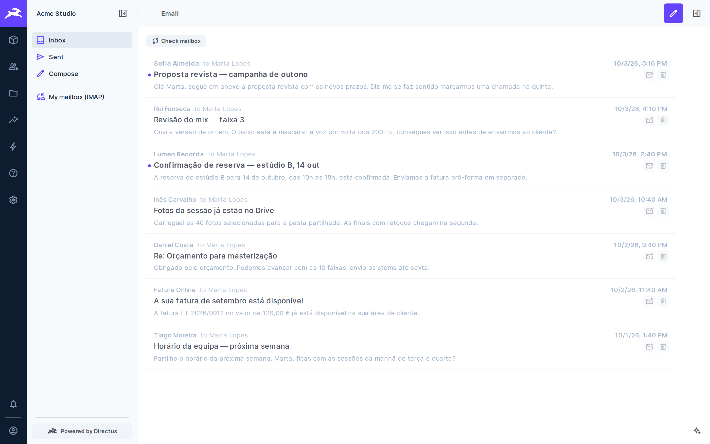
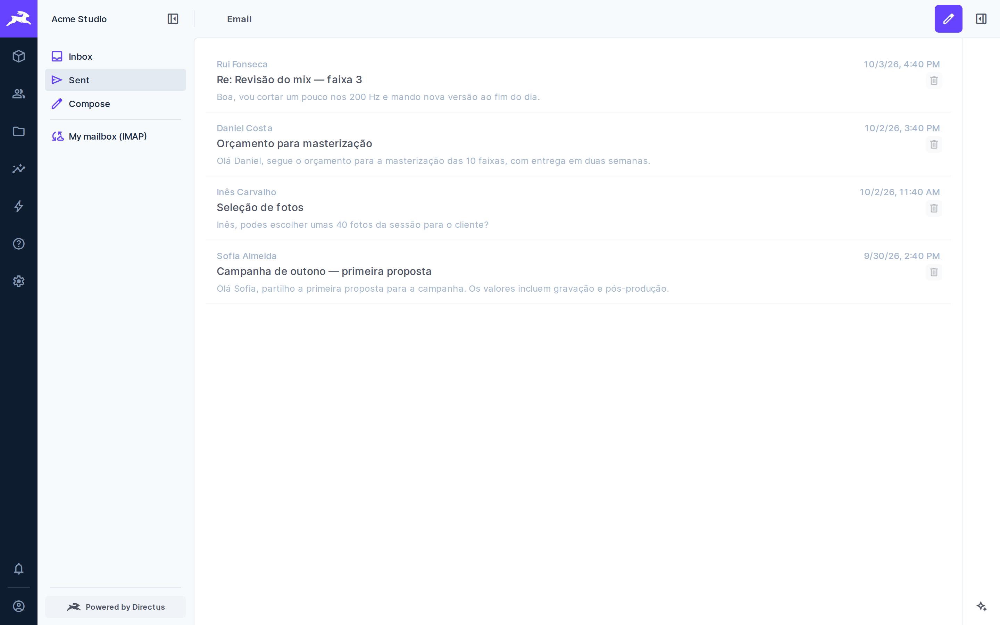
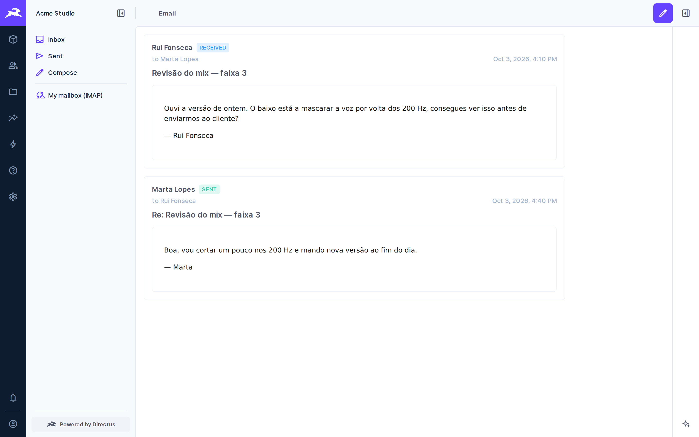
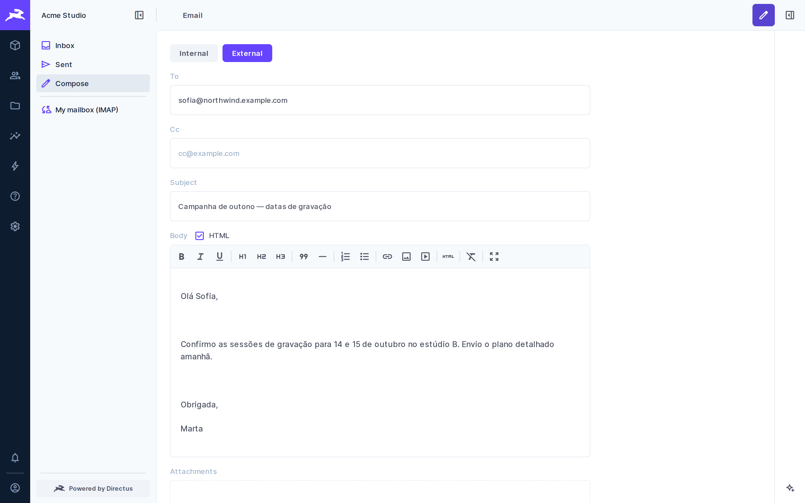
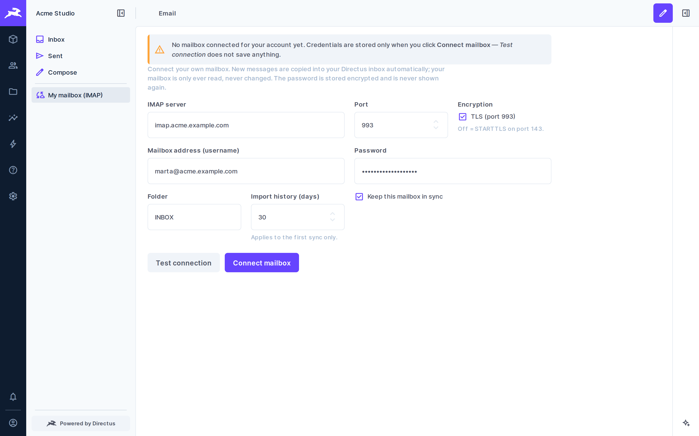

# Team Email

[](https://github.com/staminna/directus-extension-team-email/actions/workflows/ci.yml)
[](https://codecov.io/gh/staminna/directus-extension-team-email)
[](https://www.npmjs.com/package/@staminna/directus-extension-team-email)
[](LICENSE)

Send, receive and thread email inside Directus. Every user gets their own inbox,
backed by your own SMTP server rather than a third-party mailbox.

- **Inbox, Sent and Compose** as a Directus module, with per-user ownership.
- **Internal messages** between Directus users that never touch a mail server.
- **External messages** over your existing SMTP settings, mirrored into the
  recipient's Directus inbox when the recipient is also a Directus user.
- **Conversations** that merge received and sent messages by `Message-ID`.
- **Inbound mail** through a webhook that speaks Postmark's Inbound JSON, with
  attachments stored in Directus files.
- **Per-user sender addresses** through an alias table, so people send as
  themselves rather than as one shared account.

## Screenshots

All names, addresses and messages below are fictitious demo data.

**Inbox** — received mail for the signed-in user, unread marked with a dot.



**Sent** — messages sent by the signed-in user, internal and external.



**Conversation** — received and sent messages merged into one thread.



**Compose** — internal messages to Directus users, or external mail over SMTP.



**My mailbox (IMAP)** — per-user mailbox settings; the password is stored
encrypted and never shown again.



## Before you install: this is not a sandboxed extension

The Directus Marketplace installs all App extensions, but only **sandboxed** API
extensions. The sandbox grants an extension three things — `log`, `sleep` and
`request` — and no database, no `ItemsService`, no mailer and no Node builtins.

This extension needs all of those, so it cannot be sandboxed. In practice:

- Installing from the Marketplace UI requires `MARKETPLACE_TRUST=all` on your
  instance.
- Otherwise install it manually: copy the package into your extensions
  directory, or `npm install` it there, and restart Directus.

If you are not comfortable running a non-sandboxed extension, stop here. It
reads and writes your database directly, and it can send mail as your server.

## Requirements

- Directus **12.x**.
- A working mail configuration (`EMAIL_TRANSPORT` and the `EMAIL_SMTP_*`
  settings), or a Resend API key.
- The collections this extension stores mail in. They are **not** created for
  you; see *Schema* below.

## Install

```bash
npm install @staminna/directus-extension-team-email
```

Then apply the schema and restart Directus.

## Schema

The extension stores mail in six collections: `emails` (outbox), `inbox_email`
(received), `email_aliases` (who sends and receives as what), `email_templates`,
and the attachment junctions `emails_files` and `inbox_email_files`.

### Automatic install over the API (any database)

`schema/schema.json` holds only this extension's collections, fields and
relations (the IMAP mailbox table included). The bundled script reads it and
creates whatever is missing through the Directus API. It never updates or
deletes anything, `--dry-run` shows the plan first, and it is safe to re-run.
It needs an admin token:

```bash
cd ./node_modules/@staminna/directus-extension-team-email
DIRECTUS_URL=https://cms.example.com DIRECTUS_TOKEN=<admin token> \
  node scripts/install-schema.mjs --dry-run
DIRECTUS_URL=https://cms.example.com DIRECTUS_TOKEN=<admin token> \
  node scripts/install-schema.mjs
```

No restart is needed. The API cannot create CHECK constraints or plain indexes,
so this route leaves out three value checks and one sync index. The extension
works without them; on PostgreSQL, `install.sql` below adds them.

> Do not pass `schema.json` to `directus schema apply` or `POST /schema/apply`
> on an existing project. Like any snapshot, everything missing from it would be
> deleted.

### On an existing Directus project (PostgreSQL)

Run the additive installer. It only creates things, never drops them, and it is
safe to re-run:

```bash
psql "$DB_URL" -f ./node_modules/@staminna/directus-extension-team-email/schema/install.sql
```

Restart Directus afterwards so it picks up the new tables. PostgreSQL only; on
another database, create the collections by hand from the Data Model screen.

### On a brand-new, empty project only

```bash
npx directus schema apply ./node_modules/@staminna/directus-extension-team-email/schema/snapshot.yaml
```

> **Do not run this against a project that already has collections.** A Directus
> snapshot describes the *whole* schema, so `schema apply` deletes every
> collection missing from it. Always look at the plan it prints before
> confirming, and never pass `--yes` here.

### Permissions are yours to set

Neither path creates a policy, and without one non-admin users see nothing. A
sensible starting point for a normal user:

| Collection | Action | Filter | Fields |
|---|---|---|---|
| `inbox_email` | read | `owner = $CURRENT_USER` | all |
| `inbox_email` | update | `owner = $CURRENT_USER` | `is_read`, `read_at` |
| `inbox_email` | delete | `owner = $CURRENT_USER` | — |
| `emails` | create | — | all |
| `emails` | read | `owner = $CURRENT_USER` | all |
| `emails` | delete | `owner = $CURRENT_USER` | — |
| `emails_files`, `inbox_email_files` | read, create | — | all |

The extension writes delivery status (`status`, `sent_at`,
`provider_message_id`, `error_message`) with a system-level service, so do
**not** grant users update on those fields. Granting them would let a user
rewrite their own delivery history.

## Configuration

| Variable | Default | Purpose |
|---|---|---|
| `EMAIL_SEND_TRANSPORT` | `resend` | `smtp` uses the Directus mailer; `resend` uses the Resend HTTP API |
| `EMAIL_FROM` | — | Fallback sender, and the SMTP envelope sender |
| `EMAIL_SEND_TIMEOUT_MS` | `30000` | Upper bound on one send. The Directus mailer has no timeout of its own, and a stalled relay can otherwise hold a request open indefinitely |
| `EMAIL_SEND_ALLOWED_ROLES` | — | Comma-separated role IDs allowed to send. Empty means everyone |
| `RESEND_API_KEY` | — | Only for the `resend` transport |
| `EMAIL_INBOUND_USER` / `EMAIL_INBOUND_PASS` | — | HTTP Basic credentials the inbound webhook must present |
| `EMAIL_INBOUND_ALLOWED_IPS` | — | Optional allowlist for the inbound webhook |
| `EMAIL_ATTACHMENTS_FOLDER` | — | `directus_folders` id attachments are stored in. Keep it out of every permission's readable-folder list |
| `EMAIL_MAX_ATTACHMENT_BYTES` | `26214400` | Total attachment bytes per message, 25 MB |

No credentials live in the source. Everything above is read from the
environment at runtime.

## Receiving mail

`POST /email/inbound/postmark` accepts Postmark Inbound JSON over HTTP Basic
auth. That is a payload format, not a dependency on Postmark: anything that can
POST the same shape works, including a small self-hosted SMTP listener.

Routing is data, not code. Each row in `email_aliases` maps an address to a
`owner`:

- The **envelope recipient** is matched first, then every `To` and `Cc` address.
- A message addressed to several of your users creates **one inbox row per
  user**.
- An alias with **no owner** is how you model a shared mailbox: mail to it is
  stored but appears in nobody's personal inbox.
- `can_send` separates the two jobs an alias can have. An address you only
  *receive* on — a forwarder target on a domain your relay does not host — must
  have `can_send` off, or the module may try to send from it and the relay will
  refuse with `550 unable to send email from this domain`.
- A wildcard row of the form `*@example.com` catches a whole domain.

## Endpoints

| Route | Notes |
|---|---|
| `GET /email/health` | Public liveness probe |
| `GET /email/recipients` | Users you can address |
| `GET /email/message/:id/body` | One message body as its own document |
| `GET /email/message/:id/attachment/:fileId` | One attachment, after checking the message is yours |
| `GET /email/config` | Attachment folder and size limit, for the compose screen |
| `POST /email/send` | Send to any address |
| `POST /email/internal/send` | Send to Directus users only |
| `GET /email/threads/:id` | One conversation |
| `POST /email/inbox/:id/read` \| `/unread` | Mark read |
| `DELETE /email/inbox/:id`, `DELETE /email/sent/:id` | Delete your own |

Two deliberate design decisions worth knowing about:

- **`GET /email/recipients` returns the name and email address of every active
  user to any authenticated caller.** The compose screen needs a recipient list,
  and the alternative is granting every user a broad read on `directus_users`,
  which is worse. If that trade-off does not suit you, do not expose the module
  to untrusted users.
- **Message bodies are served as their own document** with a policy that allows
  remote images and nothing else, rather than inlined into the app. An inlined
  frame inherits the Directus app's Content-Security-Policy, whose `img-src`
  allowlist leaves real HTML mail full of broken images. The frame is sandboxed
  either way, so scripts never run.

## Attachments

Composing offers both halves in one control: files from your own disk through
the OS file dialog, and files that already exist in the Directus file library.
Attachments are linked to the message, so they appear in Sent and in the
conversation for everyone on it.

Set `EMAIL_ATTACHMENTS_FOLDER` to a `directus_folders` id. **Keep that folder out
of every permission's readable-folder list.** That is the point: a file in a
readable folder is readable by everyone holding the policy, through the file
library, whether or not they were on the message. Access is granted per message
instead, by `GET /email/message/:id/attachment/:fileId`, which reads the parent
with the caller's own accountability before serving any bytes.

`EMAIL_MAX_ATTACHMENT_BYTES` caps the total per message, 25 MB by default. Two
reasons to keep a cap: most receivers reject more, and inline base64 attachments
are additionally bounded by Directus's own `MAX_PAYLOAD_SIZE`, 1 MB by default,
which works out at roughly 700 KB of actual file. Attaching by file id, which is
what the compose screen does, sidesteps that entirely — files are uploaded
through `POST /files` and only their ids travel in the message body.

Stored files are streamed into the message rather than buffered, so a large
attachment does not sit in memory. The Resend transport is the exception: its
API takes base64 only, so a file is read into memory for that path.

## Known limitations

- The endpoint claims the route prefix `/email` and the module claims
  `/admin/email`. It will collide with any other extension that wants those.
- Marking a message read here does not mark it read in your mail client. This
  is a copy of your mail, not a two-way sync.
- Recipient matching is by address. Someone who was Bcc'd, with no alias row for
  the envelope recipient, cannot be resolved.

## Development

```bash
npm install
npm test            # run the test suite (Vitest)
npm run coverage    # tests + coverage report (fails below 95% lines)
npm run typecheck
npm run build
```

CI runs typecheck, tests with coverage, build and `directus-extension validate`
on Node 22 and 24 for every push and pull request to `main`.

## License

MIT. See [LICENSE](LICENSE).
